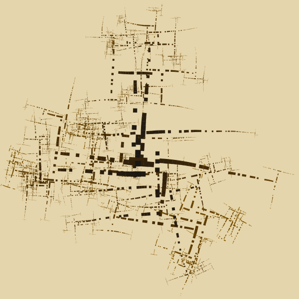
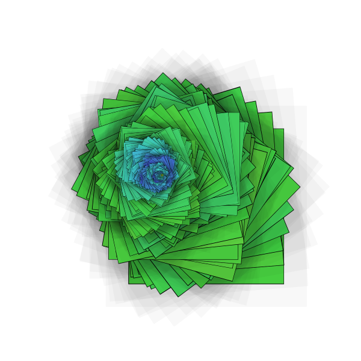
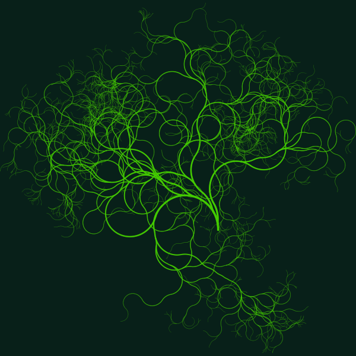

I like algorithmic art. It is not to be confused with generative AI-art, when you would ask a neural net to draw you an avocado chair.
Rather you would go and write a small program telling computer to draw something you want.
It is not like one replaced another - these approaches are very different and produce very different results.
I actually like both, but this post is about algorithmic art.

I came across a tool, called  [contextfree](https://www.contextfreeart.org/).
With it you would define a grammar with weighted probabilistic rules, and the tool would sample an image following those rules.
It was fun to use, but rules had to be written in a special language and that part was not fun.

So I decided to re-write it in Python.
I mean, not just the tool itself, but making it so that the language in which you define the rules is also Python!
Basically you would write Python functions and decorate them to assign probabilities,
then the runtime would introspect the code and call functions for you, respecting assigned probabilities and checking if it is time to break recursion because an element became to small.

The tool is called... [pycontextfree](https://pycontextfree.blackbird.pw/)! ba dum tss!
Just go to the website, there's a complete tutorial, samples etc. Cheers!

p.s.
creating art with pycontextfree is also a terrific way to learn Python! And here are some example images:

  
  
  


