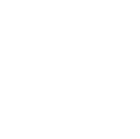
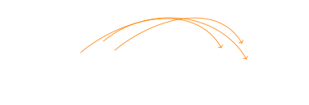
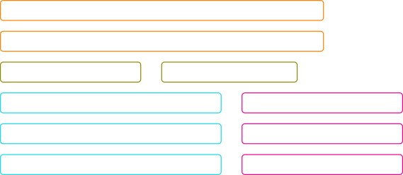
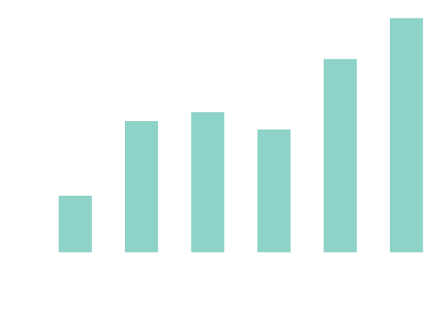
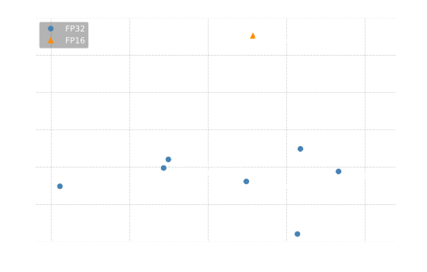
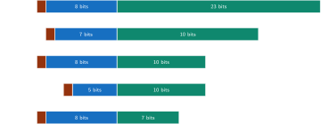

## Pareto optimality

One important concept to grasp before talking about performance is Pareto Optimality.
We didn't yet discuss what "performance" is and  how to measure it, but let's assume we have some metric for it.
And we also have some metric for model's predictive quality - accuracy, f1 or whatever. Let's call it "fidelity"
The thing is, often trying to improve one metric, we would worsen the other.
In other words, there will often be a tradeoff. For instance, large model could be more accurate, but slower.

A set of solutions for which this trade-off holds true,
that is any other solution that is better on one metric, will be worth on another one - is called a Pareto frontier.

Look at the illustration. Solutions A, B and C look like they are pareto-optimal.
Solution D - not that much.

Imagine now that model A has 91.3% accuracy and model B - 91.2%, but is three times faster. Which one is better? It depends, doesn't it?



## Mapping from parameters to metrics

It all looks nice and (semewhat) easy in 2D case, but real life is much more high-dimensional.
We have a lot of metrics that we are interested in, and we have many parameters that affect the metrics.



In a sense, there is a mapping (like a fiber bundle?) from an N-dimensional space of parameters to an M-dimensional space of metics.
Measuring performance is all about discovering this mapping. Easy!

## Oracle

Often we would be interested in effect of a single parameter - what is the best learning rate?
What is the best batch size? What is the best hardware?
Because the mapping is often non-linear, we can not simply keep all parameters as they are and change just the one we are interested in.
Ideally, for each value of a parameter we are interested in, we would as some `oracle` to give an optimal set of all other parameters.
And that's assuming we are interested in a single metrics. And if we bring Pareto optimality in - oh boy.
And we don't actually have such oracle, so we can only approximate it by doing some sort of exploration of parameter space,
using grid search, using machine learning approaches, or manually by relying on our intuition.

## Metrics

Okey, finally, what are the metrics which we care about?
Let's leave fidelity metics out of scope - that's typically your accuracy, perplexity if we talk intrinsic evaluation of LLMs - things like that.
Speaking about performance, there are two I'd like to focus on.

### Time/cost to solution

Time to solution is a very intuitive metric,  used in many fields.
Hardware A trains a model to convergence in 10 hours, hardware B trains the same model in 5 hours.
Hardware B must be better! Simple!

Except device B consumed three times as much power...
Okey, let's talk about how do we normalize when we discuss `throughput`. There are few more issues with time to solution.
For one, it depends on some accuracy threshold which is hard to define.
Converge to 82.1% in one hour or to 82.2% in 10 hours? Or never reach that accuracy?
I not possible to specify target precisely due to the inherent stochastic of DL.
And training a model to convergence each time is expensive to start with.
And uhm what if team A devised some smart training regime that converge faster, and team B just trained with vanilla SGD.
Ok, we can constrain training regime, but what if it disadvantages certain hardware (it has a lot of RAM and could benefit from larger batch size).
But before going there, let's talk about another useful metrics:

### Throughput

Throughput is an amount of work done in a unit of time. Or in a unit of electricity.
Or in a unit of cost. Except how do you count cost?
There are capital expenses, which is how much you payed for your system, but we probably want to normalize by time.
And here I wish beforehand we knew how long we would use a system...
Operational expenses are electricity and repair and space and oh, you probably hate me by now.

OKAY!, let's assume we don't care about electricity, system is already bought for us - we just care about work per time.


The problem is if with better throughput model has inferior fidelity, but we have the same problem with time to solution.
Let's assume we do some independent check that the model converges to the accuracy we want once in a while,
or we just assume we have some correctness check and we know our system does exactly the operations we want, mathematically speaking - and we only measure how fast it does it.

Overall I like measuring throughput better.
It makes more sense. It is easier to measure  - can be done in smaller compute budget.
It also makes sense for inference, not just for training.
I suggest we focus on measuring throughput! :)

### Diagnostic metrics

There are few more things we can measure which can help us understand what's going on.

FLOP/s is a good example - it can show how well your arithmetic hardware is utilized - useful when you do optimization.


## Parameters

Parameters are all those things we can change.
Parameters come with a fair amount of structure to them.
First of all there are some hierarchies.
If you select a deep learning framework - you can choose a particular backend for it quite often.

Some parameters are more malleable than other.
Say, learning rate you can make pretty much any value.
Hardware platforms - here choices are much more restricted.


Some parameters have more pronounced Pareto effect.
Batch size increases throughput but can possibly decreases convergence.
Clock speed only increases throughput (well, strictly speaking it increases temperature :)

Some parameters are more sensitive - it could be hard to find optimal learning rate schedule.

## The art of benchmarking

is all about reducing exploration space.
Finding some subspaces/ manifold that are interesting.
Making projections to safely eliminate as many parameters as possible.
Reducing dimensionality. Trying to making some some of this whole mess :)

## Task and model

One parameter we care a lot　I'd call "task". Are we doing machine translation or image recognition.
However you don't just do "image recognition".
Common step is approximate a task by a dataset. Say `ImageNet` for image recognition.
And then you choose a model which is hopefully representative - like recent SOTA, or just a "model everybody is using".
Or you try different models in exploration of Pareto frontier.
Choice of the model arguably has the largest impact on the both accuracy to performance.


## Deep Learning Framework

To do deep learning you would typically use a piece of software called deep learning framework.
My journey into performance-related aspects of deep learning actually started from a small
script I wrote back in the day to compare Theano (yeah that was a framework of choice back then :) and MXNet.
Then I ended up developing a beefed up benchmarking framework, participating in MLPerf activities,
writing specification related to AI-performance for procuring country's largest supercomputers - but I digress.

Let's say you want co compare harare A and B. You choose you model, run it with a given framework on both devices and collect numbers.
What can go wrong?
One very likely bias is that you framework could be not as optimized for another hardware.
Making things work on new hardware is easy. Making things work fast is extremely difficult.
To get good performance from popular hardware platforms (like NVidia GPUs) took effort of hundreds of engineers working for many years. Literally.

What do we do if our hardware is so new that no framework is optimized for it?

## Software Stack

Deep learning software stack looks something like this:



When you do benchmarking closer to the top level - you get somewhat better approximate of lower bound of your possible performance.
The idea is that there are possible inefficiencies accumulated through all levels of stack, but you at least get the performance you get. It can only improve from there!

On the other hand. at the lower levels of the stack you get better approximation of the upper bound.
Of course you can not measure samples per second of ResNet50 training with just BLAS (library doing matrix multiplication) and project from there.
Intuition being that more basic libraries are easier to port... The catch here is that better, say, matrix multiplication FLOP/s do not necessarily
lead to proportionally faster performance of the real model. There could be memory-bound kernels and all other sorts of unavoidable inefficiencies.

Well, if you measure close to peak FLOP/s with BLAS, and then close to peak FLOP/s with real model - it means things are as good as it gets.

## Existing Philosophies

### DeepBench

The first "big" one was DeepBench. Back in 2017, when Andrew NG was with Baidu, they rolled out
a set of deep learning benchmarks. Iw was a set of very low-level kernels, that is - at the bottom of our stack.
GEMM (another abbreviation for matrix multiplication), convolutional and recurrent kernels or various shapes etc.

### DAWNBench and others

Then people at Stanford said "hey but this does not necessarily correspond to real performance. Let's just train ImageNet in any way you fancy and report and-to end time". Which is cool, but then it opened a door for all sorts of tricks and hacks and things which make it hard to interprete what's going ont. The thing was called  DAWNBench, by the way.

There were a bunch of other efforts - aspiring to collect more representative models, or make them more parametrizable.
The one you probably heard about is MLPerf.

### MLPerf

MLPerf started in around 2020, largely inspired by DAWNBench.
It focuses on end-to-end training time, intended to be more of a "real performance".
At the same time to avoid "gaming" of training regime - it is pretty much fixed.
To the extend where training curve of a submission must pass though given control points.

This creates a lot of problem. It is nearly impossible to create a training regime
(choice of optimizer[s], preheat and LR scheduling, batch size etc) that would converge reliable on systems on different scales.
Fixed training regime does not necessarily allow a given system to perform efficiently.

Also, in this setup the bigger system wins - so MLPef incentivizes scale, and efficiency is ignored.
Scale but itself is a problem  - most of the "normal" models have limit to how much they can scale.
I'm talking about model convergence and large batches size issues, not computational aspects.
Unless you train GPT-4, but then training it to convergence (assuming you can even define what convergence is) is prohibitively expensive.

If we try to focus on efficiency and normalize by, say, power consumption  -  everything suddenly is upside down.
You want to train on *as small* system as possible, to avoid networking, workload imbalance etc overheads as much as you can.

## My Take

Screw it all.
Focus on throughput. Make sure the model converges in a separate check run, with whatever optimizer and LR schedule you want.
For throughput measurement keep the same optimizer; the rest of parameters pretty don't matter.
Except numeric precision - and here I really don't know a good answer, but there will be a bit more on this issue later in the post.

If you want to make sure you benchmark network performance as well - make model size big enough so that you have to go model-parallel
given realistic RAM sizes on accelerators we have now or can have in near future.
And if somebody comes up with some fancy device with ungodly amount of RAM on it and can fit the whole model - well, isn't it a good thing?

Use individual kernels to "diagnose" your hardware - the banner of DeepBench is carried on my a number of groups now, and the kernels include fancy things like accelerator kernel invocation latency etc.

### Benchmarker

I myself still use that old Python tool I started ten years ago.
Basically it imports standard models from PyTorch/ TF libraries, runs them with synthetic data,
collects performance numbers and as much of other metadata as possible, from framework version to hardware performance counters.
It can do whole models, custom models (transformer with N heads, M layers etc) individual layers, simple kernels like GEMM etc.

You can run it by typing something like this
```
python3 -m benchmarker
--framework=pytorch
--backend=native
--tensor_layout=native
--problem=roberta_large_mlm
--cnt_samples=512
--sample_shape=256
--batch_size=64
--nb_epoch=10
--preheat
--mode=training
--precision=TF32
--gpus=0
--power_nvml
```

This is nothing big, no distributed training, although there used to be some MPI network benchmarks.
Didn't touch them for a while but maybe they still work :)
But it is a small handy tool, every time a get my hands on new GPU I run a couple of models to get some idea about its performance.
If we plot it nicely, it will (well this is from many many years  ago, let's call it a memorabilia piece) look like this:




Didn't we say something about normalization?
Let's at least divide by power consumption and get samples per Joule.



Interesting! So from generation to generation per Joule performance improvement was not that huge...
Jump to lower precision was a big thing, but that's not a trick you can repeat many times.


## Back to Parameters

But let's get to parameters.
A particularly tricky one is numeric format: how many bits are used to store numbers, how
those bits are rationed for exponent vs precision; and some other nuances.




These are some common formats, but there are posits, there are numerics where an exponent is shared across a block of numbers, and other sorts of exotic beasts.

This zoo of numeric formats is a big pain in the ass for deep learning performance benchmarking.
Naturally lower precision improves performance. But it can hurt accuracy.
And it is not transferable between models - what works for one model does not necessarily work for another one.
And even for a selected model - making a given numeric format work might require certain unobvious hacks.


So how do we compare two devices if they support different numeric formats?
One idea was "let them use whatever they can work, and call it AI FLOP's".
Well, if only we could somehow make sure that training regime is tuned right for given numerics...

ANother approach is, and that's what I would have recommended you to do if you asked me yesterday - use BF16.
Most of devices now support BF16, and we know it works of for most of the models we care about.

Oh, and there is `mixed` precision! That is, some operations are done in one precision, some operations in another.
Or operands are in lower precision, result is accumulated in hight precision (say for multiplying two matrix tiles) and then lowered to original one.

For this I also had a brilliant idea - let's say that lowest precision you ever touch "infects" your whole run and it counts as being done in that lower precision. How do we compare say FP16 with BF16- they are both 16 bit? Which is lower?

Well, uhm, ahm, that's not important anymore because we have a new problem. A new trend and I believe it is here to stay.
Now we decompose a single high precision operation into a series of operations in lower precision.
Say doing 8 operations on 8-bit integers to represent one float operation. Search for "Ozaki scheme" if you are interested in how it can be done.
Or maybe I will write a post about it later ;)

The thing is we have some flexibility of how much or original precision we want to retain, but it is hard to precisely put a bit count on it.

What do we do about it? I don't freaking know.

## P.S. Few Words on Inference

Especially LLM inference. We have prefill and decode stages,
performance depends on prompt length. We have  Time To First Token (TTFT) and Time Per Output Token (TPOT) and
batching usually helps but you wan to do it dynamically for sequences coming in real time from users.
And cache KV-cache between generations. And do RAG.
Nah guys, let's end here for good. Maybe next time. Love you all.